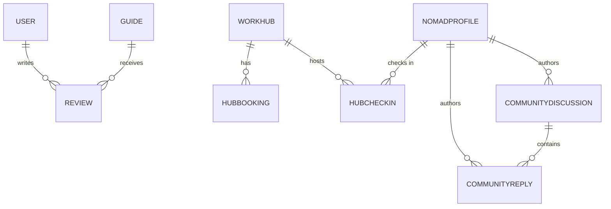
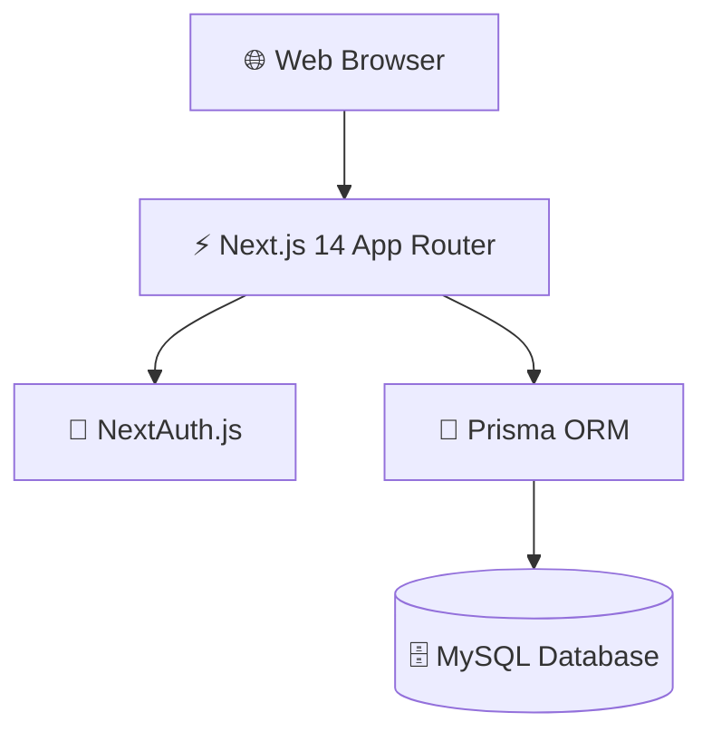
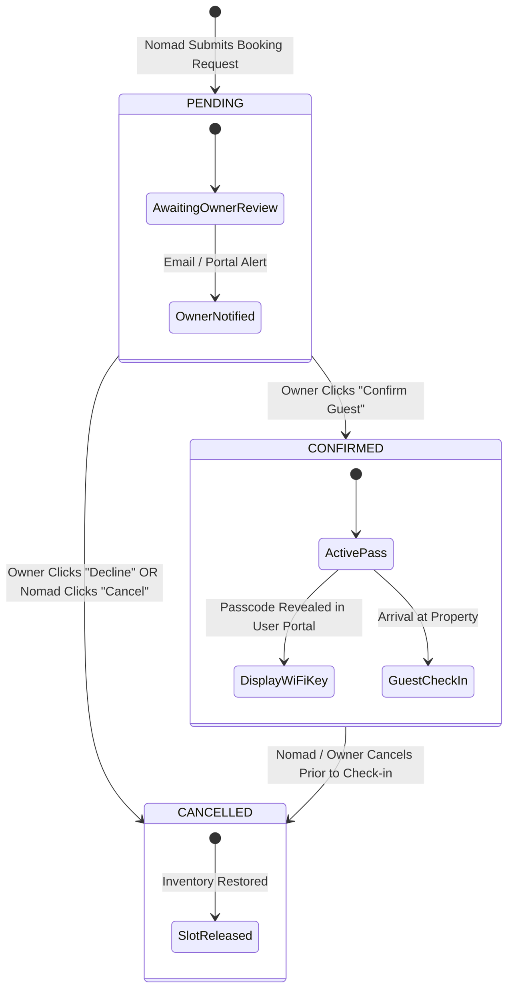
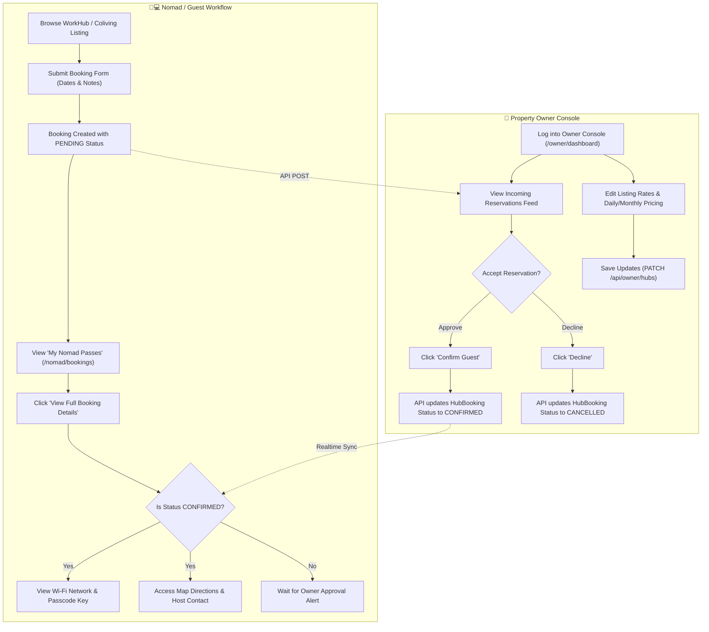

# Digital Nomads Nepal — System Diagrams & Architecture Documentation

This document contains complete text-based, ASCII, and Mermaid diagram specifications for the **Digital Nomads Nepal** platform.

---

## 1. ENTITY-RELATIONSHIP (ER) DIAGRAM — TEXT SPECIFICATION

### Database Engine: MySQL / SQLite (Prisma ORM)

```
===================================================================================
                                ENTITY SCHEMA & RELATIONS
===================================================================================

[ USER ] (Platform Authentication User Account)
  ├── id            : String (PK, CUID)
  ├── email         : String (Unique)
  ├── name          : String
  ├── password      : String (Hashed)
  ├── role          : Enum (NOMAD | GUIDE | ADMIN)
  └── createdAt     : DateTime
  └── Relations     : 1:N -> REVIEW

[ GUIDE ] (Verified Local Expert Guide Profile)
  ├── id            : String (PK, CUID)
  ├── name          : String
  ├── bio           : String
  ├── location      : String (e.g. "Pokhara")
  ├── specialties   : Json Array (e.g. ["Annapurna Trekking", "Culture"])
  ├── photoUrl      : String (Optional)
  ├── contactEmail  : String
  ├── isVerified    : Boolean (Default: false)
  ├── avgRating     : Float (Default: 0.0)
  ├── totalReviews  : Int (Default: 0)
  └── createdAt     : DateTime
  └── Relations     : 1:N -> REVIEW

[ REVIEW ] (Rating & Comment given to Guide)
  ├── id            : String (PK, CUID)
  ├── rating        : Int (1 to 5)
  ├── comment       : String
  ├── guideId       : String (FK -> GUIDE.id, OnDelete: Cascade)
  ├── userId        : String (FK -> USER.id, OnDelete: Cascade)
  └── createdAt     : DateTime
  └── Constraint    : UNIQUE (guideId, userId)

[ WORKHUB ] (Coworking Hubs, Coliving Suites & Workation Lodges)
  ├── id            : String (PK, CUID)
  ├── name          : String
  ├── slug          : String (Unique)
  ├── city          : String (e.g. "Kathmandu", "Pokhara", "Mustang")
  ├── description   : Text
  ├── address       : String
  ├── ownerEmail    : String (Optional)
  ├── ownerName     : String (Optional)
  ├── spaceType     : String (Default: "Coworking Hub")
  ├── units         : Json (Rooms, Hot Desks, Coliving Suites, Meeting Halls)
  ├── openingHours  : String (Default: "24/7 Access")
  ├── rating        : Float (Default: 0.0)
  ├── totalReviews  : Int (Default: 0)
  ├── isVerified    : Boolean (Default: false)
  ├── isPartner     : Boolean (Default: false)
  ├── photoUrl      : Text (Single URL or JSON array string)
  ├── facilities    : Json (e.g. ["Starlink Wi-Fi", "Solar Backup"])
  ├── priceDaily    : Float (Starting daily rate)
  ├── priceMonthly  : Float (Discounted monthly rate)
  ├── contactEmail  : String
  ├── website       : String (Optional)
  ├── createdAt     : DateTime
  └── updatedAt     : DateTime
  └── Relations     : 1:N -> HUBBOOKING, 1:N -> HUBCHECKIN

[ HUBBOOKING ] (Nomad Reservation Enquiries & Bookings)
  ├── id            : String (PK, CUID)
  ├── hubId         : String (FK -> WORKHUB.id, OnDelete: Cascade)
  ├── nomadName     : String
  ├── nomadEmail    : String
  ├── startDate     : DateTime
  ├── endDate       : DateTime
  ├── notes         : Text (Optional)
  ├── status        : Enum (PENDING | CONFIRMED | CANCELLED)
  ├── createdAt     : DateTime
  └── updatedAt     : DateTime

[ NOMADPROFILE ] (Public Digital Nomad Community Profile)
  ├── id            : String (PK, CUID)
  ├── name          : String
  ├── email         : String (Unique)
  ├── passwordHash  : String (Optional)
  ├── country       : String (Country of origin)
  ├── currentCity   : String (e.g. "Kathmandu")
  ├── workType      : Enum (DEVELOPER | DESIGNER | WRITER | MARKETER | ENTREPRENEUR | EDUCATOR | OTHER)
  ├── bio           : Text (Optional)
  ├── avatarUrl     : String (Optional)
  ├── linkedinUrl   : String (Optional)
  ├── twitterUrl    : String (Optional)
  ├── isPublic      : Boolean (Default: true)
  ├── emailAlerts   : Boolean (Default: true)
  ├── createdAt     : DateTime
  └── updatedAt     : DateTime
  └── Relations     : 1:N -> HUBCHECKIN, 1:N -> COMMUNITYDISCUSSION, 1:N -> COMMUNITYREPLY

[ HUBCHECKIN ] (Live Check-In Status at WorkHubs)
  ├── id            : String (PK, CUID)
  ├── profileId     : String (FK -> NOMADPROFILE.id, OnDelete: Cascade)
  ├── hubId         : String (FK -> WORKHUB.id, OnDelete: Cascade)
  ├── checkInAt     : DateTime (Default: now())
  └── checkOutAt    : DateTime (Optional, null = currently checked in)

[ COMMUNITYDISCUSSION ] (Nomad Forum Topics)
  ├── id            : String (PK, CUID)
  ├── title         : String
  ├── content       : Text
  ├── category      : String (Default: "General")
  ├── authorId      : String (FK -> NOMADPROFILE.id, OnDelete: Cascade)
  ├── likes         : Int (Default: 0)
  ├── createdAt     : DateTime
  └── updatedAt     : DateTime
  └── Relations     : 1:N -> COMMUNITYREPLY

[ COMMUNITYREPLY ] (Forum Topic Replies)
  ├── id            : String (PK, CUID)
  ├── content       : Text
  ├── discussionId  : String (FK -> COMMUNITYDISCUSSION.id, OnDelete: Cascade)
  ├── authorId      : String (FK -> NOMADPROFILE.id, OnDelete: Cascade)
  ├── createdAt     : DateTime
  └── updatedAt     : DateTime

[ POST ] (Digital Nomad Guides & Blog Articles)
  ├── id            : String (PK, CUID)
  ├── slug          : String (Unique)
  ├── title         : String
  ├── excerpt       : String
  ├── content       : LongText
  ├── coverImage    : String
  ├── category      : String
  ├── tags          : Json
  ├── readTime      : String
  ├── affiliates    : Boolean (Default: false)
  ├── featured      : Boolean (Default: false)
  ├── author        : String
  ├── published     : Boolean (Default: true)
  ├── createdAt     : DateTime
  └── updatedAt     : DateTime

[ DESTINATION ] (Nepal Destinations & Remote Work Hub Cities)
  ├── id            : String (PK, CUID)
  ├── name          : String
  ├── slug          : String (Unique)
  ├── description   : String (Optional)
  ├── tags          : Json
  ├── image         : String
  ├── createdAt     : DateTime
  └── updatedAt     : DateTime

[ RESOURCEITEM ] (Travel & Remote Work Tools/Visas)
  ├── id            : String (PK, CUID)
  ├── name          : String
  ├── description   : String
  ├── link          : String
  ├── category      : String
  └── createdAt     : DateTime

[ SUBSCRIBER ] (Newsletter Mailing List)
  ├── id            : String (PK, CUID)
  ├── email         : String (Unique)
  └── createdAt     : DateTime

[ ADMIN ] (System Administrator Account)
  ├── id            : String (PK, CUID)
  ├── email         : String (Unique)
  ├── password      : String (Hashed)
  └── createdAt     : DateTime
===================================================================================
```

---

## 2. UML CLASS DIAGRAM — TEXT SPECIFICATION

```
===================================================================================
                             UML CLASS SPECIFICATIONS
===================================================================================

Class: User
-----------------------------------------------------------------------------------
Attributes:
  - id          : String
  - email       : String
  - name        : String
  - password    : String
  - role        : Role [NOMAD, GUIDE, ADMIN]
Methods:
  + register(name, email, password) : User
  + login(email, password) : Session
  + postReview(guideId, rating, comment) : Review

Class: WorkHub
-----------------------------------------------------------------------------------
Attributes:
  - id           : String
  - name         : String
  - slug         : String
  - city         : String
  - spaceType    : String
  - priceDaily   : Float
  - priceMonthly : Float
  - facilities   : Array<String>
  - units        : Array<Unit>
  - isVerified   : Boolean
  - isPartner    : Boolean
Methods:
  + calculateWorkabilityScore() : Int (0-100)
  + hasColiving() : Boolean
  + filterByCity(city) : List<WorkHub>
  + filterByCategory(category) : List<WorkHub>

Class: HubBooking
-----------------------------------------------------------------------------------
Attributes:
  - id           : String
  - hubId        : String
  - nomadName    : String
  - nomadEmail   : String
  - startDate    : Date
  - endDate      : Date
  - status       : BookingStatus [PENDING, CONFIRMED, CANCELLED]
Methods:
  + calculateDurationDays() : Int
  + calculateLongTermDiscount() : Float
  + confirmBooking() : Void
  + cancelBooking() : Void

Class: NomadProfile
-----------------------------------------------------------------------------------
Attributes:
  - id           : String
  - name         : String
  - email        : String
  - country      : String
  - currentCity  : String
  - workType     : WorkType [DEVELOPER, DESIGNER, WRITER, MARKETER, etc.]
  - isPublic     : Boolean
Methods:
  + checkInToHub(hubId) : HubCheckIn
  + checkOutFromHub(checkInId) : Void
  + createDiscussion(title, content, category) : CommunityDiscussion

Class: Guide
-----------------------------------------------------------------------------------
Attributes:
  - id           : String
  - name         : String
  - bio          : String
  - location     : String
  - specialties  : List<String>
  - isVerified   : Boolean
  - avgRating    : Float
  - totalReviews : Int
Methods:
  + updateProfile(bio, specialties) : Guide
  + calculateAverageRating() : Float
===================================================================================
```

---

## 3. SYSTEM ARCHITECTURE — ASCII COMPONENT TREE

```
===================================================================================
                           SYSTEM ARCHITECTURE TREE
===================================================================================

[ CLIENT / BROWSER LAYER ]
  │
  ├── Desktop Browser (Chrome, Firefox, Safari)
  └── Mobile Devices (iOS Safari, Android Chrome)
        │
        ▼  HTTP/HTTPS Requests
[ APPLICATION SERVER LAYER — Next.js 14 App Router ]
  │
  ├── Frontend UI Pages & Layouts (React 18 + Tailwind CSS)
  │     ├── /resources/coworking ── Workspaces & Coliving Marketplace
  │     ├── /stay ──────────────── Nomad Stays & Accommodation Directory
  │     ├── /stay/register ─────── Stay & Coliving Registration Form
  │     ├── /resources/coworking/register ── Workspace Registration Form
  │     ├── /guides ────────────── Local Expert Guides Directory
  │     ├── /community ────────── Nomad Community Forum & Live Check-Ins
  │     └── /admin ────────────── Platform Administration Dashboard
  │
  ├── API Controllers & Handlers (Node.js Engine)
  │     ├── /api/work-hubs ────── Fetch, filter & search workspaces & coliving
  │     ├── /api/work-hubs/register ── Register property submission
  │     ├── /api/work-hubs/upload ── Dual image upload handler
  │     ├── /api/community ────── Forum discussions, replies & profiles
  │     └── /api/admin ────────── Admin management endpoints
  │
  └── Authentication & Authorization Layer
        └── NextAuth.js (Session Cookies, JWT, Credentials Provider)
        │
        ▼  Query Invocation
[ DATA ACCESS LAYER — Prisma ORM ]
  │
  └── Prisma Client Engine (Type-safe SQL queries & JSON filtering)
        │
        ▼  TCP/IP Connection
[ DATABASE LAYER — MySQL Server ]
  │
  └── Relational Schema (14 Tables, Indexes on slugs, emails, ratings)
===================================================================================
```

---

## 4. USE CASE MATRIX SPECIFICATION

```
===================================================================================
                               USE CASE MATRIX
===================================================================================

[ ACTOR 1: DIGITAL NOMAD ]
  ├─ UC-01: Search & Filter Workspaces
  │    Description : Nomad filters spaces by City (e.g. Mustang, Pokhara), Category, or Facilities.
  │    Precondition: None.
  │
  ├─ UC-02: Filter Coliving (Live & Work)
  │    Description : Nomad selects "🛌 Coliving (Live & Work)" tab to view properties offering room+workspace packages.
  │    Precondition: None.
  │
  ├─ UC-03: Book Workspace / Coliving Suite
  │    Description : Nomad opens single-scroll booking modal, selects seat/suite type, dates, and submits booking.
  │    Precondition: Selected workspace detail page open.
  │
  ├─ UC-04: Live Check-In at WorkHub
  │    Description : Nomad checks into a workspace to signal real-time presence to other community members.
  │    Precondition: Nomad profile created and authenticated.
  │
  └─ UC-05: Post & Reply in Nomad Forum
       Description : Nomad asks questions or replies to visa, housing, or meetup topics.
       Precondition: Nomad authenticated.

[ ACTOR 2: PROPERTY & SPACE OWNER ]
  ├─ UC-06: Register Workspace / Coliving Property
  │    Description : Owner fills out property details, Starlink/backup power info, room inventory, and uploads photos.
  │    Precondition: User authenticated.
  │
  └─ UC-07: Manage Inventory & Pricing Rates
       Description : Owner sets daily rates, monthly rates, and unit availability counts.
       Precondition: Registered owner account.

[ ACTOR 3: PLATFORM ADMIN ]
  ├─ UC-08: Verify WorkHub Facilities
  │    Description : Admin reviews submitted property, verifies speed test & power backup, and toggles isVerified badge.
  │    Precondition: Admin role privileges.
  │
  └─ UC-09: Manage Destinations & Guides
       Description : Admin adds new cities (e.g. Mustang), publishes blog posts, and verifies local guides.
       Precondition: Admin role privileges.
===================================================================================
```

---

## 5. MERMAID GRAPHICAL DIAGRAMS

### A. Entity-Relationship Diagram (Mermaid)



### B. System Component Diagram (Mermaid)



---

## 6. OWNER PLATFORM MANAGEMENT & NOMAD USER EXPANDABLE BOOKING DIAGRAMS

### A. Property Owner Platform Management Flow (Text / ASCII Diagram)

```
===================================================================================
                  PROPERTY OWNER PLATFORM & BOOKING CONTROL WORKFLOW
===================================================================================

 [ OWNER PORTAL ] (/owner/dashboard)
        │
        ├────────────────────────────────────────────────────────────────────────┐
        ▼                                                                        ▼
 [ 1. LISTING & RATES MANAGEMENT ]                       [ 2. GUEST RESERVATIONS ENGINE ]
   ├── View Listed WorkHubs & Coliving Lodges               ├── Incoming Guest Request Feed
   ├── Update Daily Starting Rate ($/day)                   ├── Review Guest Details:
   ├── Update Discounted Monthly Rate ($/mo)                │     ├─ Guest Full Name & Email
   ├── Update Access Hours (e.g. 24/7 Access)              │     ├─ Check-in & Check-out Dates
   ├── Edit Facilities (Starlink, Solar Backup)             │     ├─ Duration (Total Stay Days)
   └── Save Listing Modifications (PATCH /api/owner/hubs)   │     └─ Nomad Special Notes / Demands
                                                            │
                                                            ▼
                                                   [ STATUS DECISION ]
                                                    ├── [ CONFIRM GUEST ]
                                                    │     ├─ Update Status to CONFIRMED
                                                    │     └─ Auto-dispatch Wi-Fi Passcode Key
                                                    └── [ DECLINE REQUEST ]
                                                          ├─ Update Status to CANCELLED
                                                          └─ Release Reserved Unit Slot
===================================================================================
```

### B. Nomad User Expandable Booking View Architecture (Text / ASCII Diagram)

```
===================================================================================
                 NOMAD USER EXPANDABLE BOOKING INFO ARCHITECTURE
===================================================================================

 [ NOMAD PASSES PORTAL ] (/nomad/bookings)
        │
        ▼
 [ BOOKING LIST & STATUS FILTERS ] (All / Confirmed / Pending / Cancelled)
        │
        ▼
 [ COMPACT BOOKING CARD (COLLAPSED STATE) ]
   ├── Property Photo & Hub Name (e.g. "Mustang Starlink Coliving")
   ├── Location Badge (e.g. "Mustang, Nepal")
   ├── Reservation Status Pill (CONFIRMED [Green] | PENDING [Amber] | CANCELLED [Red])
   ├── Space Type Pill (Live & Work Coliving | Work Hub Pass)
   ├── Stay Dates Summary (e.g. Sep 15, 2026 → Oct 15, 2026)
   ├── Stay Duration Badge (e.g. "30 Days Stay")
   └── [ EXPAND FULL BOOKING DETAILS ] (Interactive Button Toggle)
        │
        ▼ (On Click Expand)
 [ DETAILED BOOKING PANEL (EXPANDED STATE) ]
   ├─ COLUMN 1: RESERVED ITEM & FACILITIES
   │    ├── Space Unit (e.g. "Coliving Workcation Suite + Dedicated Desk")
   │    ├── Exact Street Address (e.g. "Jomsom Valley Center, Upper Mustang")
   │    ├── Operating Access Hours (e.g. "24/7 Unlimited Access")
   │    └── Verified Facilities (Starlink 220 Mbps, Solar Power 24/7, Heated Bed)
   │
   ├─ COLUMN 2: WI-FI NETWORK & GUEST PASS
   │    ├── Wi-Fi Network SSID (e.g. "Mustang_Starlink_Nomad")
   │    ├── Wi-Fi Passcode Key (e.g. "NOMAD_NEPAL_2026!")
   │    ├── Guest Identity Verification (Name & Email)
   │    └── Starlink Speed Guarantee Status
   │
   ├─ COLUMN 3: HOST CONTACT & ACTION BUTTONS
   │    ├── Property Owner Name (e.g. "Pema Tsering Gurung")
   │    ├── Owner Direct Email Link
   │    ├── [ MAP DIRECTIONS ] Button (Opens Google Maps)
   │    ├── [ CONTACT HOST ] Button (Direct Email Prompt)
   │    └── [ CANCEL RESERVATION ] Button (Triggers PATCH status)
   │
   └─ NOMAD REQUEST NOTES PANEL
        └── Displays guest's custom requests (e.g. quiet corner desk for calls)
===================================================================================
```

### C. Owner & Nomad Booking State Machine (Mermaid)



### D. Complete Owner & Nomad Interaction Flowchart (Mermaid)



